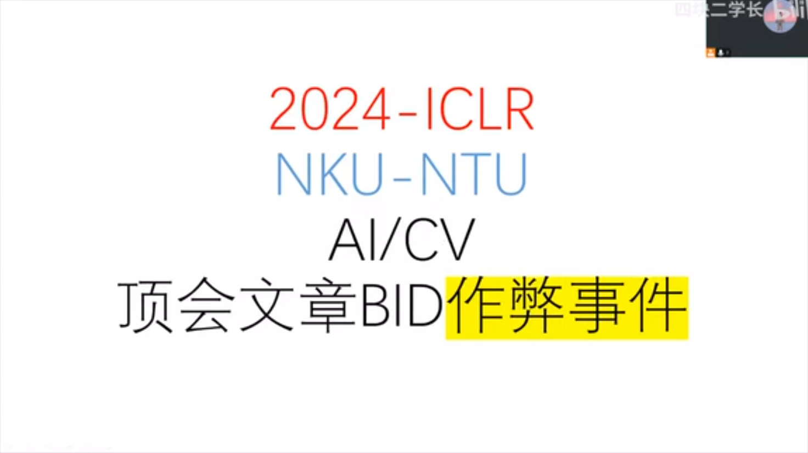
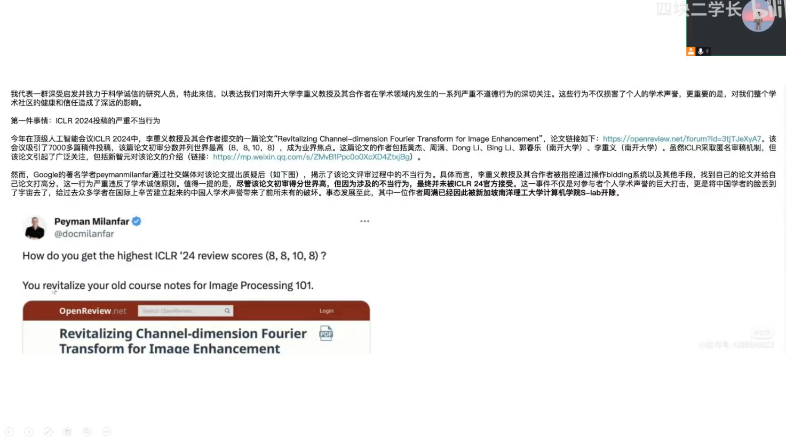
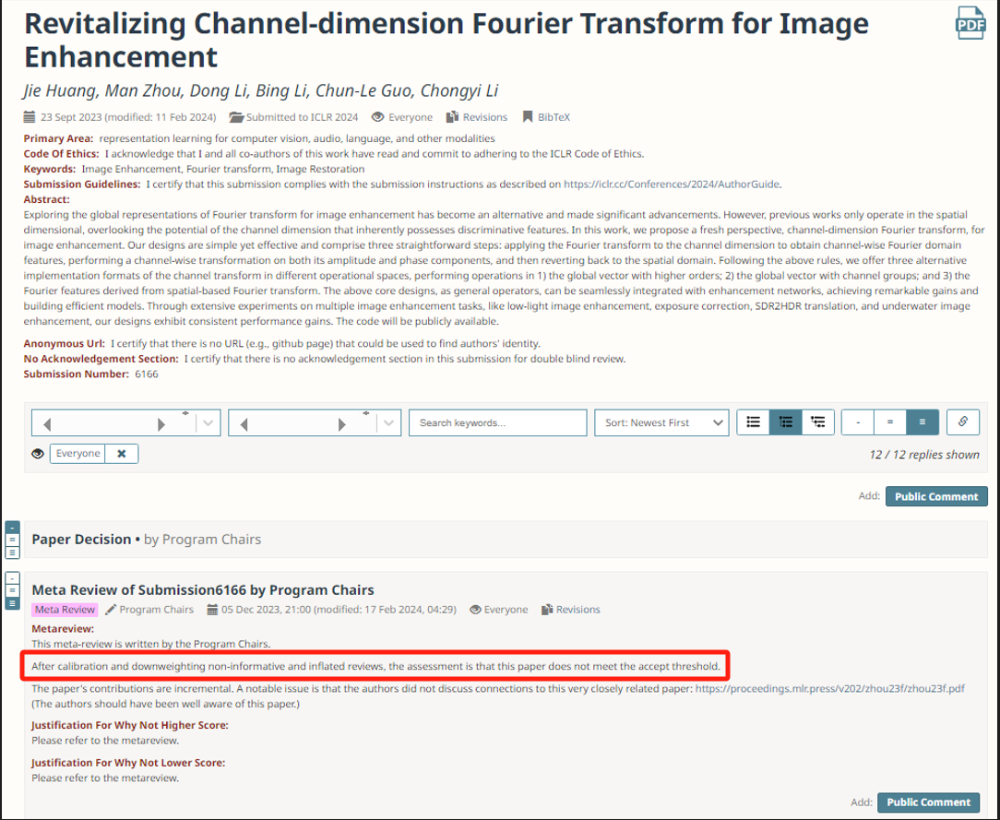

# 审稿系统的自述

# Self-introduction of the review system

我是一个论文审稿系统，[南开大学李重仪教授](https://cc.nankai.edu.cn/2021/0323/c13619a514615/page.htm)及其在南洋理工大学的合作者们，在人工智能顶级会议ICLR2024上，操作我给他们自己的论文打高分，这一严重违反学术诚信的行为，给华人学者的声誉造成巨大损害！

I am a paper review system. [Professor Li Chongyi of Nankai University](https://cc.nankai.edu.cn/2021/0323/c13619a514615/page.htm) and his collaborators at Nanyang Technological University manipulated me to give high scores to their own papers at the top artificial intelligence conference ICLR2024. This serious violation of academic integrity has caused great damage to the reputation of Chinese scholars!

由于顶会审稿机制原因，这件事本来很难查到，但是他们的论文质量实在是太差了，连Google的人都看不下去了，说这么垃圾的文章居然分那么高？最后ICLR组委会官方下场调查实锤（论文网址：https://openreview.net/forum?id=3tjTJeXyA7 ，见图3）

Due to the review mechanism of the top conference, this matter was originally difficult to find, but the quality of their papers was so poor that even Google people couldn't stand it, saying that such a rubbish article was scored so high? Finally, the ICLR organizing committee officially investigated and confirmed the facts (paper URL: https://openreview.net/forum?id=3tjTJeXyA7, see Figure 3)

目前南洋理工大学已经将涉事者开除，**但是南开大学仍未给出回应**

Currently, Nanyang Technological University has expelled the person involved, **but Nankai University has not yet responded**

相关消息在知乎、小红书等平台均被屏蔽，感谢华清大学SBC博士慷慨施教，教学课程：https://github.com/ShiArthur03/ShiArthur03 ，这鼓励我们这些学术界的正义人士向全世界告知真相

Related news has been blocked on platforms such as Zhihu and Xiaohongshu. Thanks to Dr. SBC from Huaqing University for his generous teaching. Teaching courses: https://github.com/ShiArthur03/ShiArthur03. This encourages us, the righteous people in the academic community, to tell the truth to the world.

事件整个详情见：[南开大学、南洋理工大学2024年AI顶会作弊被查](https://www.bilibili.com/video/BV1gz421U7Aw/?spm_id_from=333.337.search-card.all.click&vd_source=334824d35a6e99418c4eb39c937e1d98)

For details of the incident, see: [Nankai University and Nanyang Technological University were investigated for cheating at the 2024 AI Summit](https://www.bilibili.com/video/BV1gz421U7Aw/?spm_id_from=333.337.search-card.all.click&vd_source=334824d35a6e99418c4eb39c937e1d98)

翻译一下：审稿意见有问题，组委会重新审核后，发现这个文章质量太差，应该被拒

Translation: There are problems with the review opinions. After re-examination, the organizing committee found that the quality of this article is too poor and should be rejected.
